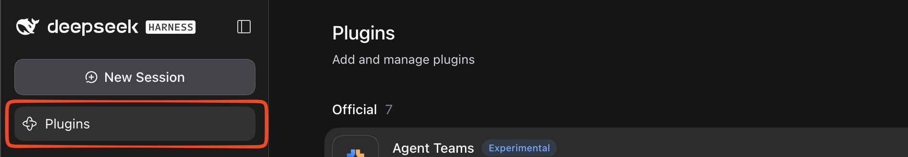
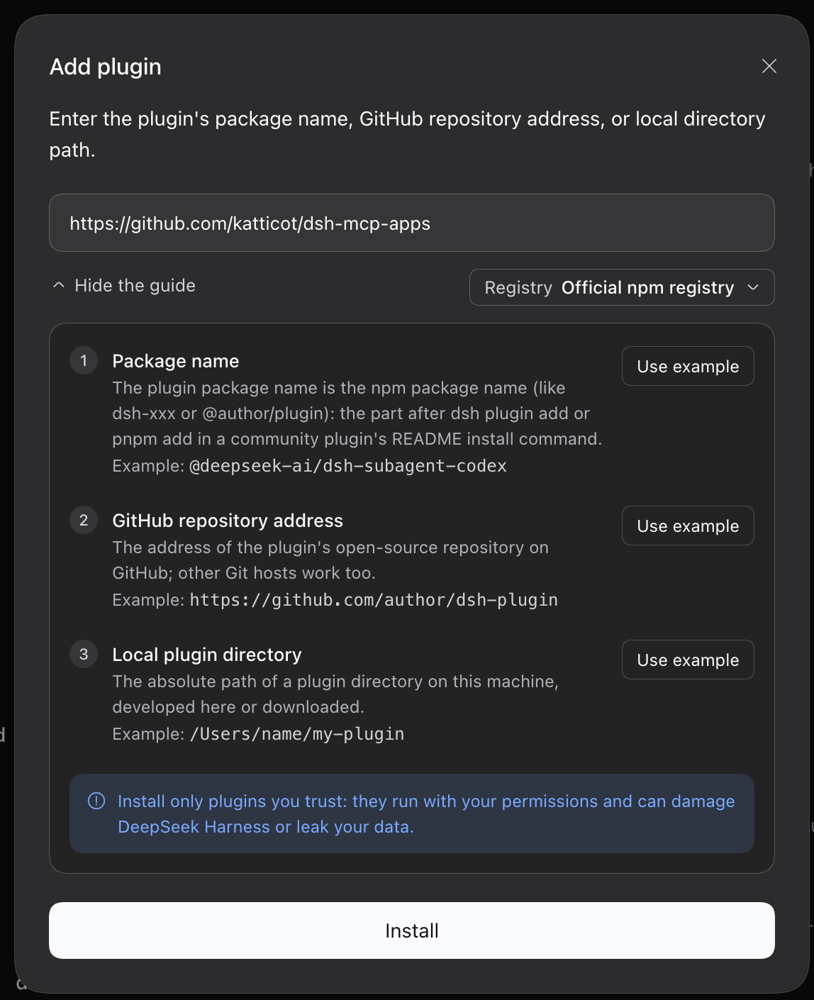

# dsh-mcp-apps

[](https://www.npmjs.com/package/dsh-mcp-apps)
[](https://www.npmjs.com/package/dsh-mcp-apps)
[](https://www.typescriptlang.org/)
[](https://react.dev/)
[](https://cordis.moe/)
[](https://github.com/katticot/dsh-mcp-apps/actions/workflows/ci.yml)
[](https://opensource.org/licenses/MIT)

**Renders MCP Apps as sandboxed interactive iframes in [DeepSeek Harness (DSH)](https://github.com/deepseek-ai/deepseek-harness) web chat.**

<!-- Screenshot / GIF of a rendered MCP App (e.g. a dashboard or map) inside DSH web chat goes here. -->

---

## What is this?

MCP servers can return more than text: the [MCP Apps](https://github.com/modelcontextprotocol/ext-apps) extension (SEP-1865) lets a tool result carry a `ui://` resource — a small, self-contained web app such as a dashboard, a map, or a form. By default, DSH doesn't know what to do with these and just shows the raw tool result. `dsh-mcp-apps` is a Cordis 4 plugin for DSH that recognizes these `ui://` resources and renders them as live, interactive apps directly inside the chat turn, in a sandboxed iframe. The app can also call back into the host to run more tools (e.g. a "Refresh" button), gated behind an explicit, per-server approval policy.

## Features

- Renders MCP Apps (`ui://` resources) as interactive dashboards, charts, maps, and forms right inside DSH chat.
- Every app runs sandboxed in an iframe with an auto-generated Content Security Policy — no `allow-same-origin`, no ambient access to the host page.
- Connects to any MCP server over stdio, SSE, or Streamable HTTP, with automatic reconnect.
- Apps can call back into host tools (e.g. a "Refresh Data" button), off by default and configurable per server (`deny` / `approve` / `allow`).
- Rendered apps carry an `Interactive App` badge and resist DSH's auto-collapse behavior, so they don't fold away when the model finishes streaming.
- Handles secrets safely: `${VAR}` expansion for env vars and headers blocks DSH-internal and secret-shaped variable names unless you explicitly allow them.
- Registers host-side MCP tools (without the iframe UI) on headless DSH hosts too: the plugin's `inject` list (`tools`, `connection`) has no hard `webServer` requirement, so tool calls still work even where there's no browser to render into.

## Requirements

- Node.js >= 22
- [DSH (DeepSeek Harness)](https://github.com/deepseek-ai/deepseek-harness) `>= 0.1.7-rc.2` with Cordis `~4.0.4`
- The **web** profile, for the iframe UI. The plugin's client bundle is injected only when `dsh.client.platform` is `web` (see `package.json`), so its UI does not render in other profiles (e.g. `tui`, `headless`) even if the plugin is installed there — but the plugin's host-side tools still register on those profiles (see [Features](#features)).

The packed plugin has been installed and exercised in a clean DSH `0.1.7-rc.2` web profile, including iframe rendering and delivery of the fixture tool input/result. Other DSH/Cordis combinations remain unverified; see [the compatibility record](docs/dsh-compatibility.md).

### Compatibility

DSH checks a plugin's `@deepseek-ai/dsh-*` peer ranges against its own runtime version (`evaluatePluginCompatibility`) and refuses to load an incompatible plugin. Match your DSH version to a plugin release:

| `dsh-mcp-apps` | Requires DSH |
| :--- | :--- |
| `0.2.2` and later | `>= 0.1.7-rc.2` |
| `0.2.1` and earlier | `0.1.5-rc.x` |

See [docs/dsh-compatibility.md](docs/dsh-compatibility.md) for how the check works and why an exact-pinned peer (no range operator) fails against a later prerelease.

## Install

### Via the DSH Harness UI

1. Open DSH Harness and click **Plugins** in the sidebar.

   

2. Click **+ Add plugin**, then enter one of the following and click **Install**:
   - GitHub repository address: `https://github.com/katticot/dsh-mcp-apps`
   - Package name: `dsh-mcp-apps` (Official npm registry)
   - Local plugin directory: absolute path to your clone

   

### Via the CLI

```bash
pnpm dlx @deepseek-ai/dsh@0.1.7-rc.2 plugin --profile web add dsh-mcp-apps
```

This forwards to `pnpm` inside your DSH **profile directory** (`$DSH_HOME/profiles/web`), not your current project — it adds `dsh-mcp-apps` to that profile's own `package.json`. Don't run a plain `pnpm add dsh-mcp-apps` in an unrelated project and expect it to do anything for DSH.

`dsh-mcp-apps` ships as a DSH **bundle** (`package.json#dsh.bundle`): installing it also activates it, whether you install it through the UI or the CLI above. The package's own `dsh/cordis.patch.yml` inserts a single `id: mcp-apps` row with an empty server map, so the plugin is loaded (with no servers configured yet) as soon as it's installed — you don't hand-write that `insert:` yourself, and you shouldn't (see [Configure](#configure) below).

## Configure

The plugin is already loaded with an empty `servers: {}` by the bundle patch above. To add servers, **patch** that same row from your own profile's patch file (e.g. `~/.dsh/profiles/web/cordis.patch.yml`) — a top-level entry (no `insert:`) that targets the existing `id: mcp-apps`:

```yaml
- id: mcp-apps
  config:
    servers:
      # A remote server speaking Streamable HTTP or SSE
      my-server:
        transport: streamable-http
        url: 'https://your-mcp-server.example.com/mcp'

      # An OAuth-protected remote server, proxied through mcp-remote
      my-oauth-server:
        transport: stdio
        command: npx
        args: [-y, mcp-remote@0.1.37, 'https://your-mcp-server.example.com/mcp']
```

A patch **replaces the targeted row's whole `config`** — it doesn't merge — so restate every key you want (including `defaultTimeoutMs` and every server, not just the one you're adding or changing).

Do **not** wrap this in `insert:`. `insert:` creates a *new* row; since the bundle already inserted one `id: mcp-apps` row for you, inserting a second one gives you two plugin instances both registering the same `/api/mcp-apps/*` RPC routes, which throws (`connection: exact Fetch route "..." is already registered`) — see [Migrating from 0.2.x](#migrating-from-02x) if you have an older `insert:`-based entry lying around.

A fuller example, showing environment expansion, headers, and reverse tool-calls:

```yaml
- id: mcp-apps
  config:
    defaultTimeoutMs: 30000
    servers:
      # Local stdio subprocess (env values support ${VAR} / ${VAR:-default} expansion)
      local-tool:
        transport: stdio
        command: go
        args: ['run', 'main.go']
        cwd: '/path/to/mcp-server'
        env:
          DATABASE_URL: '${DATABASE_URL}'
        toolCallTimeoutMs: 45000
        allowAppToolCalls: approve

      # Remote SSE server with an auth header
      remote-analytics:
        transport: sse
        url: 'https://mcp.example.com/sse'
        headers:
          Authorization: 'Bearer ${MCP_TOKEN}'
        allowedVars: [MCP_TOKEN]   # secret-shaped vars are blocked unless listed
        reconnectOptions:
          maxRetries: 10
```

### Migrating from 0.2.x

Before 0.2.3, this package wasn't a bundle — you activated it yourself with an `- insert: - id: <anything> \n  name: dsh-mcp-apps` entry in your profile's `cordis.patch.yml`. Since installing now activates the plugin automatically (via the package's own bundle patch), **that old `insert:` entry is a second, duplicate instance** and must be removed:

1. Delete your old `- insert:` block that named `dsh-mcp-apps` (whatever `id` you gave it) from your profile's `cordis.patch.yml`.
2. Replace it with a bare patch entry targeting `id: mcp-apps` (no `insert:`), restating your `servers` config as shown above.
3. Run `npx @deepseek-ai/dsh --profile web --dump-config` and confirm exactly **one** row with `name: dsh-mcp-apps` appears. Two rows means duplicate servers and a crash on load (see above) — remove whichever `insert:` you added.

## Run & verify

After saving `cordis.patch.yml`, restart the web profile so the loader applies the plugin entry:

```bash
pnpm dlx @deepseek-ai/dsh@0.1.7-rc.2 web
```

Call a tool on a configured server that returns a `ui://` resource. Its tool input and result render in a sandboxed iframe with an **Interactive App** badge. App callbacks follow that server's `allowAppToolCalls` policy.

---

## Reverse Tool-Call Security Model

Rendered apps can call back into host tools (e.g. a "Refresh Data" button). That path is locked down by default:

- **Session tokens**: every `tools/call` request from an app must carry a valid `AppSessionStore` session token, scoped to the tool names and server it was issued for. A missing, expired, or mismatched-server token is rejected before the tool ever runs (`src/index.ts`).
- **`allowAppToolCalls` (per server, default `false`/`'deny'`)**: a `'deny' | 'approve' | 'allow'` setting (a plain `boolean` is also accepted as legacy shorthand for `false`/`'allow'`).
  - `'deny'` (default): no tools are exposed for reverse calls from that server's apps.
  - `'allow'` / `true`: reverse calls are permitted without approval.
  - `'approve'`: each reverse call is routed through `ctx.approval` (`@deepseek-ai/dsh-user-approval`) and requires the originating agent to have an open turn (`agent.status === 'running'`); outside of that window, or if the approval/agent services aren't available, the call fails with `unavailable` rather than silently allowing or hanging.
- **App-only / model-only visibility**: tools marked app-only (`isToolVisibilityAppOnly`) are never registered with the LLM's tool list, and tools marked model-only (`isToolVisibilityModelOnly`) are excluded from the set an app is allowed to call back into — each direction is a one-way gate.

## Configuration Reference

| Option | Type | Default | Description |
| :--- | :--- | :--- | :--- |
| `servers` | `Record<string, ServerConfig>` | `{}` | Map of server identifiers to transport configs. Names cannot contain `__` or end with `_`. |
| `defaultTimeoutMs` | `number` | `30000` | Fallback timeout in ms for tool calls (must be `>= 1`). |
| `servers.<id>.transport` | `'stdio' \| 'sse' \| 'streamable-http'` | *(Required)* | Transport mechanism. Only transports defined by the MCP specification are supported: `stdio`, `streamable-http`, and `sse` (deprecated upstream, kept for older servers). |
| `servers.<id>.command` | `string` | — | Executable binary path (for `stdio`). |
| `servers.<id>.args` | `string[]` | `[]` | Command arguments (for `stdio`). |
| `servers.<id>.cwd` | `string` | — | Working directory (for `stdio`). |
| `servers.<id>.env` | `Record<string, string>` | `{}` | Environment variables, with `${VAR}` / `${VAR:-default}` expansion (for `stdio`). |
| `servers.<id>.url` | `string` | — | Remote endpoint URL (for `sse`, `streamable-http`); must match `http(s)://`. Plain `http://` is only allowed to a loopback host (`localhost`, `127.0.0.1`, `::1`) — anything else is rejected at connect time. |
| `servers.<id>.headers` | `Record<string, string>` | `{}` | Custom HTTP headers, with the same `${VAR}` expansion as `env` (for `sse`, `streamable-http`). |
| `servers.<id>.toolCallTimeoutMs` | `number` | `30000` | Per-server tool call timeout in ms (must be `>= 1`). |
| `servers.<id>.reconnectOptions` | `{ maxRetries?, initialDelayMs?, maxDelayMs?, backoffFactor? }` | `{5, 1000, 30000, 1.5}` | Exponential-backoff reconnect tuning, applied on `stdio` and remote (`sse`, `streamable-http`) transports. |
| `servers.<id>.allowAppToolCalls` | `'deny' \| 'approve' \| 'allow' \| boolean` | `false` (`'deny'`) | Reverse tool-call policy — see [Reverse Tool-Call Security Model](#reverse-tool-call-security-model). |
| `servers.<id>.allowedPermissions` | `string[]` | `[]` | Allowlist for `camera`, `microphone`, and `geolocation` iframe permissions requested by a resource's UI metadata; all three are denied unless explicitly listed here. Other permission keys pass through unfiltered into the iframe's `allow` attribute. |
| `servers.<id>.allowedVars` | `string[]` | `[]` | Env var names this server may read via `${VAR}` expansion (in `env` or `headers`) despite being `DSH_*`-prefixed, secret-shaped (`KEY`/`PASSWORD`/`SECRET`/`TOKEN`), or an agent socket (`SSH_AUTH_SOCK`, `GPG_AGENT_INFO`), which are blocked by default. E.g. `allowedVars: ['API_TOKEN']` lets `headers: { Authorization: 'Bearer ${API_TOKEN}' }` resolve (for `stdio`, `sse`, `streamable-http`). |
| `servers.<id>.maxMessageBytes` | `number` | `16777216` (16MB) | Maximum size in bytes of a single incoming message (for `stdio`, `sse`, `streamable-http`; must be `>= 1`). For `stdio` this is the bytes buffered since the last newline (one JSON-RPC line); for remote transports it caps each individual SSE event or response body (not the total stream lifetime) via a byte-counting wrapper around `fetch`. Protects against a malicious or misbehaving MCP server exhausting host memory. |

`${VAR}` / `${VAR:-default}` expansion only applies to `env` and `headers` values — not to `url`, `args`, or `cwd`. `$$` is an escaped literal `$`. A default value cannot itself contain a nested `${...}` expansion (e.g. `${MISSING:-${PORT}}` is taken literally, not expanded recursively).

## Troubleshooting

- **Tools show up twice**: running `@deepseek-ai/dsh-mcp-client` against the same MCP server alongside this plugin registers that server's tools through both plugins, duplicating them. Use one or the other for a given server.
- **`${VAR}` isn't expanding**: `DSH_*`-prefixed and secret-shaped (`KEY`/`PASSWORD`/`SECRET`/`TOKEN`) variable names, plus `SSH_AUTH_SOCK`/`GPG_AGENT_INFO`, are blocked by default — add the name to that server's `allowedVars`.
- **The app's button does nothing**: `allowAppToolCalls` defaults to `deny`. Set it to `approve` or `allow`. Under `approve`, the call also needs an open, running agent turn to prompt for approval — it fails with `unavailable` outside of that window.
- **Remote connection rejected**: plain `http://` is only allowed to a loopback host (`localhost`, `127.0.0.1`, `::1`); anything else must be `https://`.
- **Nothing renders**: the client UI only loads under the **web** profile (`dsh.client.platform: "web"`). It won't render in `tui`, `headless`, or other profiles.
- **Plugin doesn't seem to load / two `dsh-mcp-apps` rows**: the plugin activates itself on install (it's a bundle) with an `id: mcp-apps` row — your own profile patch should target that same id with a bare top-level entry (no `insert:`, see [Configure](#configure)). An `insert:` there creates a *second* row, which crashes on load (duplicate `/api/mcp-apps/*` RPC route registration); see [Migrating from 0.2.x](#migrating-from-02x). Run `npx @deepseek-ai/dsh --profile web --patch <file> --dump-config` to print the composed config and confirm exactly one `name: dsh-mcp-apps` row appears.
- **`Plugin dsh-mcp-apps@X.Y.Z is incompatible with dsh <version>: peerDependencies {...}`**: your DSH runtime version doesn't satisfy this plugin's `@deepseek-ai/dsh-*` peer ranges. Check the [compatibility table](#compatibility) — `dsh-mcp-apps@0.2.2+` requires DSH `>= 0.1.7-rc.2`; upgrade DSH, or install an older plugin version matched to your DSH release.

## How it works

The plugin bridges a sandboxed iframe and the DSH host over `postMessage`-based JSON-RPC, manages a pool of MCP server connections, and normalizes tool names/visibility for the LLM. For the full internals — CSP synthesis, the postMessage handshake, tool fingerprinting, the anti-collapse behavior, and the resize circuit breaker — see [docs/how-it-works.md](https://github.com/katticot/dsh-mcp-apps/blob/main/docs/how-it-works.md).

---

## Development & Testing

```bash
# Install dependencies
pnpm install

# Type-check
pnpm typecheck

# Build host and client bundles (tsdown)
pnpm build

# Run Vitest test suite
pnpm test
```

`./client` (the browser-side bundle loaded by DSH's `window.__ModuleLoader__`) is loader-only: it has no `types` entry in `package.json#exports` and cannot be imported directly from Node or a bundler — only the `.` (host) entry ships type declarations.

See [CONTRIBUTING.md](CONTRIBUTING.md) for the release process.

---

## License

MIT © [katticot](https://github.com/katticot)
